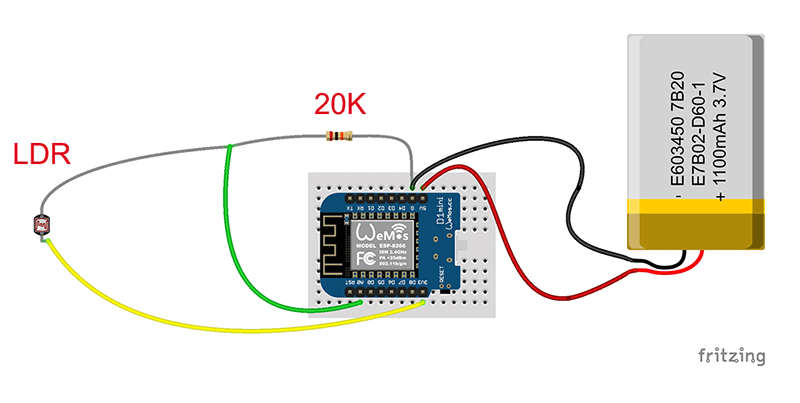
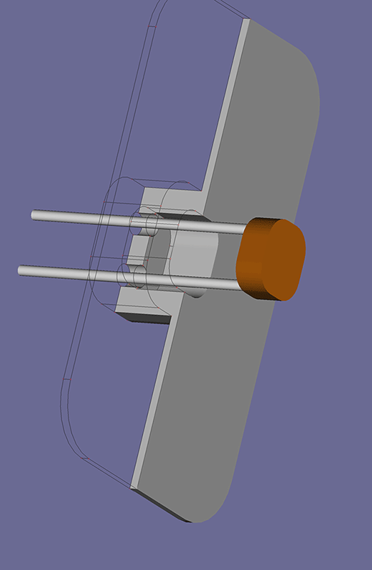
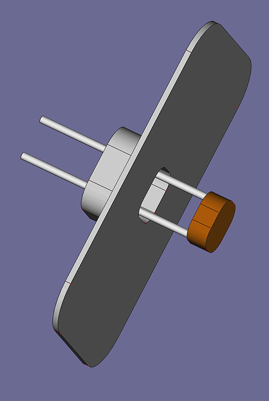

# idIOT
## implementing dummy iot

Añadiendo un poco de IoT (no invasivo) a electrodomesticos "torpes".

Muchos de nuestros electrodmesticos "menos modernos" nos indican su funcionamiento o termino de proceso mediante una luz que se enciende o se apaga, o parpadea...
Podemos obtener notificaciones de ellos mediante la lectura de dichas señales luminosas.
Para ello podemos usar una simple LDR como sensor de luz y un bot de telegram en un ESP8266 o ESP32.
(Ampliable a otro tipo de informaciones que deseamos medir como 'beeps', cambios de color de una luz...)

## Esquema de montaje

## Firmware
La carpeta **SRC** contiene el firmware y el fichero **librerias.rar** las librerias necesarias, por si otras versiones (pasadas o futuras) pudiesen no ser compatibles.

## Freecad
En la carpeta frecad se encuentra el modelo 3D de un soporte para la LDR

